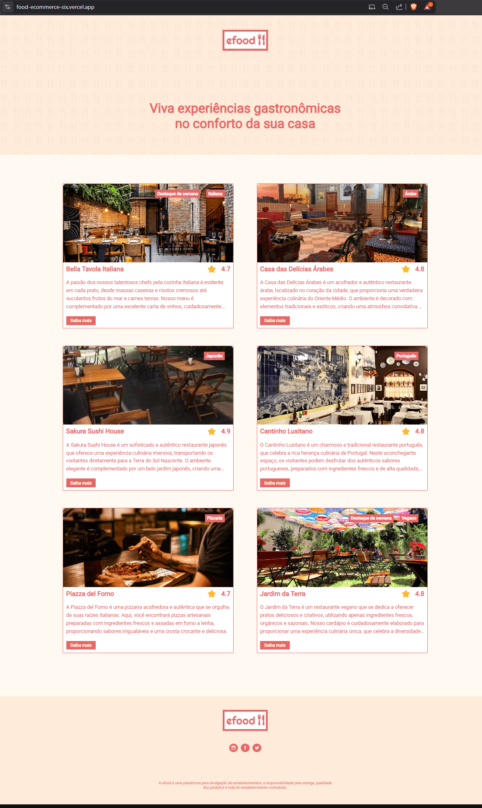
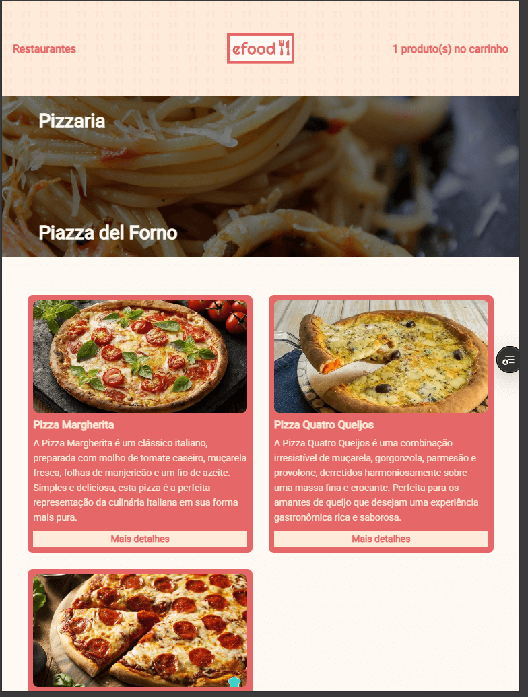
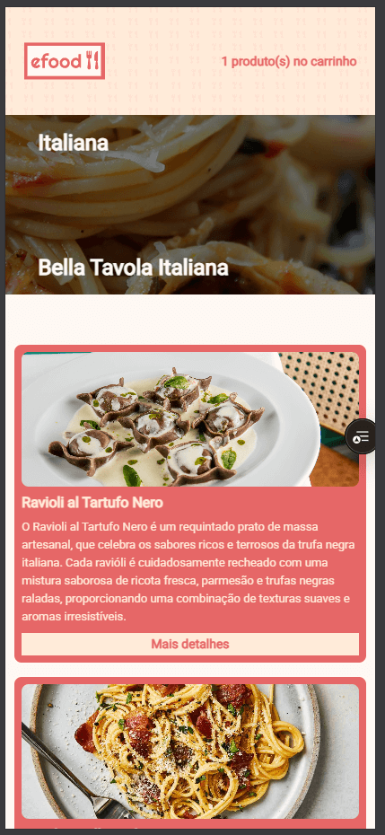
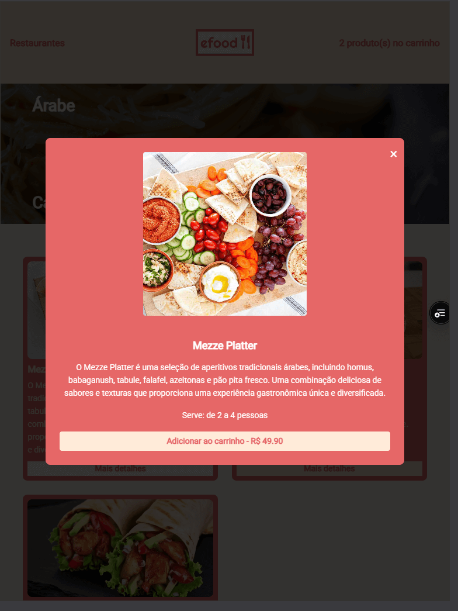
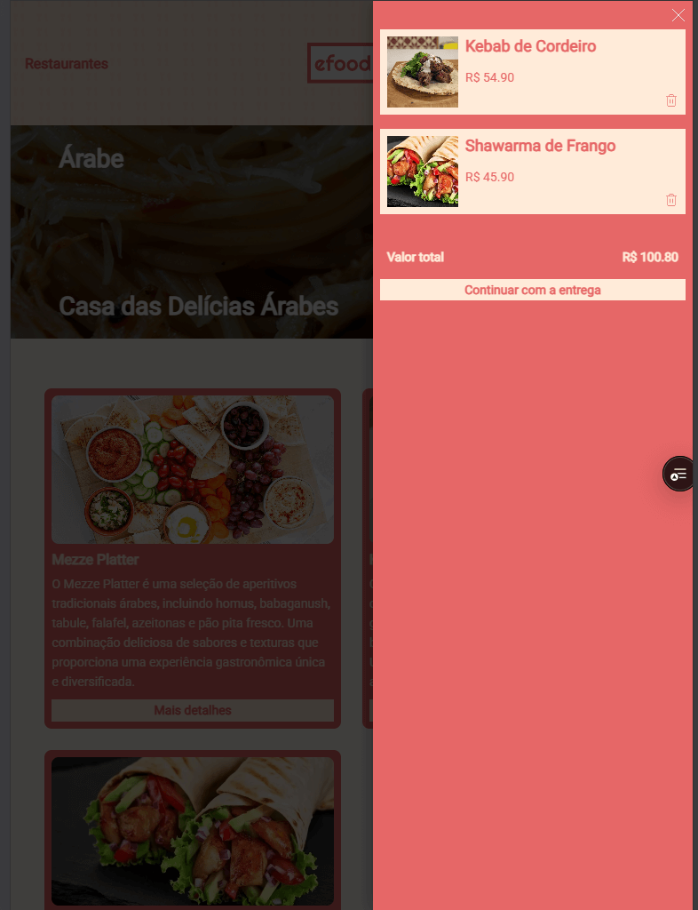
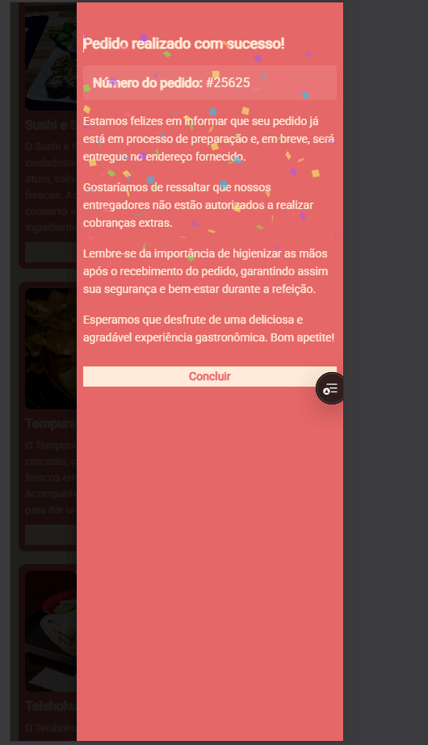

# Max React Template - Rapid, Scalable Web Development Starter

A responsive food e-commerce platform built with React, Redux, TypeScript, Styled Components, Fake Store API. This application allows users to browse restaurants, view menu items, add items to the cart, and complete the checkout process.

## 🖼️ Project Demo

## Live Demo On Vercel

Check out the live demo: [Food E-commerce](https://food-ecommerce-six.vercel.app/)

## Demo Preview

## Features

- Restaurant listing and filtering
- Detailed restaurant view with menu items
- Add to cart functionality with quantity control
- Smooth cart animations
- Multi-step checkout process:
  - Address information
  - Payment details (with card validation)
  - Order confirmation
- Responsive design for all devices
- State management with Redux
- Form validation

## Technologies Used

- React.js
- TypeScript
- Redux & Redux Toolkit
- Styled Components
- React Router
- Formik

## How to Run

1. Clone this repository
2. Install dependencies with `npm install`
3. Run the development server with `npm start`
4. Access the application at `http://localhost:3000`

## 🌟 Why Use This Template?

### 🚀 Accelerate Your Development
This template is designed to jumpstart your React projects with a robust, production-ready foundation. Save hours of initial setup and focus on building your unique features.

### 🛡️ Best Practices Included
- Preconfigured with TypeScript for type safety
- Integrated styling with Styled Components
- Comprehensive routing setup
- Optimized development workflow

### 🔧 Fully Customizable
- Modular architecture
- Easy to extend and modify
- Follows modern React development standards

### 💡 Key Advantages
- **Quick Setup**: Zero-configuration start
- **Performance Optimized**: Lightweight and fast
- **Scalable Structure**: Easily grow your application
- **Modern Tech Stack**: Leveraging latest React and TypeScript features

## 🚀 Quick Start

### Prerequisites
- Node.js (v18 or later)
- npm (v9 or later)

### Installation

1. Clone the repository

`git clone https://github.com/maxh33/food-ecommerce.git`

`cd food-ecommerce`

2. Install dependencies

`npm install`

3. Start the development server

`npm start`

## 🛠️ Technologies & Stack

### Core Technologies
- **React** (v19.0.0): JavaScript library for building user interfaces
- **TypeScript**: Adds static typing to JavaScript
- **React Router**: Routing library for React applications

### Styling
- **Styled Components**: CSS-in-JS library for component-level styling

### Development Tools
- **Create React App**: Toolchain for React project setup
- **ESLint**: Code linting
- **Prettier**: Code formatting

### Additional Libraries
- **Web Vitals**: Performance measurement
- **React Testing Library**: Testing utilities

## Additional Images

## 🔧 Customization Guide

### Adapting the Template

1. **Styling**
   - Modify `src/styles.ts` to change global styles and color palette
   - Update component-specific styles in respective `styles.ts` files

2. **Components**
   - Replace placeholder components in `src/components/`
   - Add new components as needed

3. **Routes**
   - Modify `src/routes.tsx` to add/remove pages
   - Create new page components in `src/pages/`

4. **Assets**
   - Replace images in `src/assets/images/`
   - Update logos, icons, and banner images

## 📂 Project Structure

### Root Directory
- `src/` - Source code directory

### Assets
- `assets/`
  - `images/` - Image resources

### Components
- `components/`
  - `Banner/` - Banner component
  - `Button/` - Button component
  - `Footer/` - Footer component
  - `Header/` - Header component

### Pages
- `pages/`
  - `Home/` - Home page
  - `Others/` - Other pages

### Core Files
- `styles.ts` - Global styles
- `App.tsx` - Main application component
- `index.tsx` - Entry point
- `routes.tsx` - Route definitions

## Like it? Star the project and Follow me!

LinkedIn: [https://www.linkedin.com/in/maxhaider/](https://www.linkedin.com/in/maxhaider/)

## Learn More

You can learn more in the [Create React App documentation](https://facebook.github.io/create-react-app/docs/getting-started).

To learn React, check out the [React documentation](https://reactjs.org/).

### Code Splitting

This section has moved here: [https://facebook.github.io/create-react-app/docs/code-splitting](https://facebook.github.io/create-react-app/docs/code-splitting)

### Analyzing the Bundle Size

This section has moved here: [https://facebook.github.io/create-react-app/docs/analyzing-the-bundle-size](https://facebook.github.io/create-react-app/docs/analyzing-the-bundle-size)

### Making a Progressive Web App

This section has moved here: [https://facebook.github.io/create-react-app/docs/making-a-progressive-web-app](https://facebook.github.io/create-react-app/docs/making-a-progressive-web-app)

### Advanced Configuration

This section has moved here: [https://facebook.github.io/create-react-app/docs/advanced-configuration](https://facebook.github.io/create-react-app/docs/advanced-configuration)

### Deployment

This section has moved here: [https://facebook.github.io/create-react-app/docs/deployment](https://facebook.github.io/create-react-app/docs/deployment)

### `npm run build` fails to minify

This section has moved here: [https://facebook.github.io/create-react-app/docs/troubleshooting#npm-run-build-fails-to-minify](https://facebook.github.io/create-react-app/docs/troubleshooting#npm-run-build-fails-to-minify)

